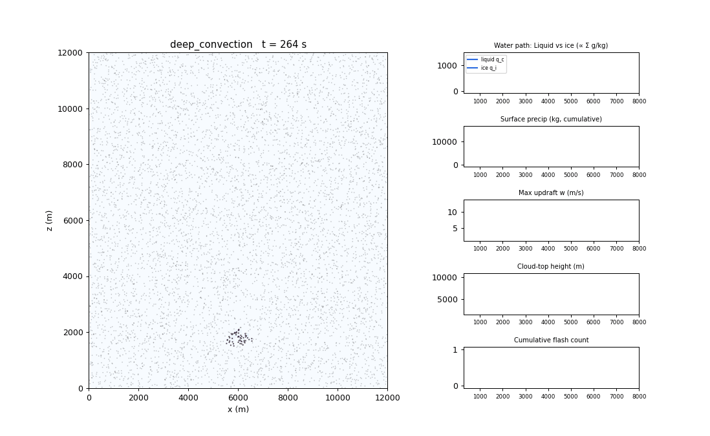
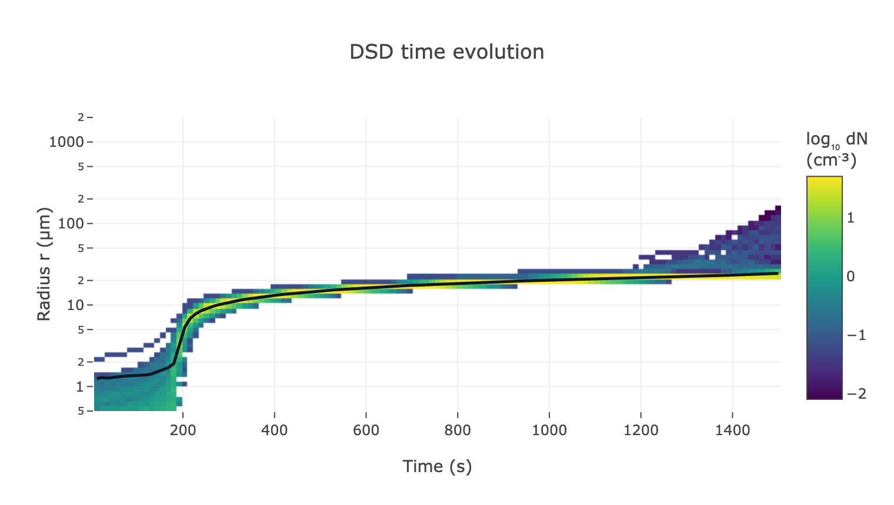
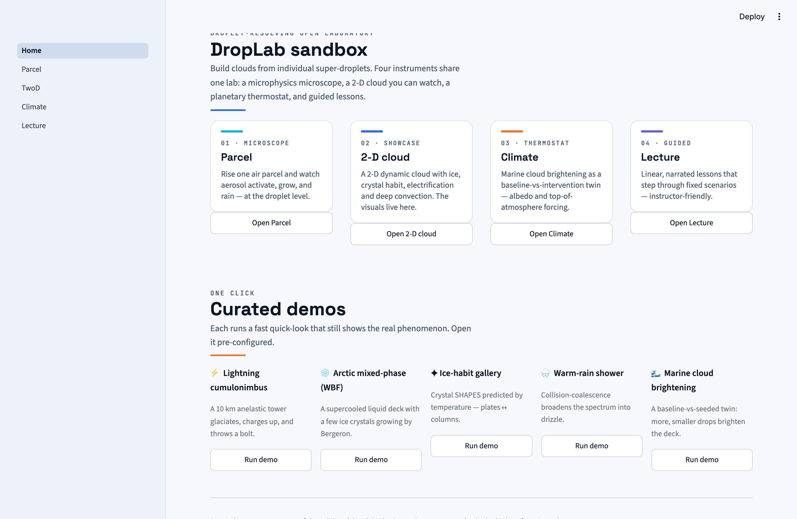
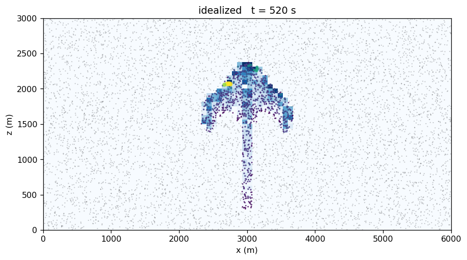
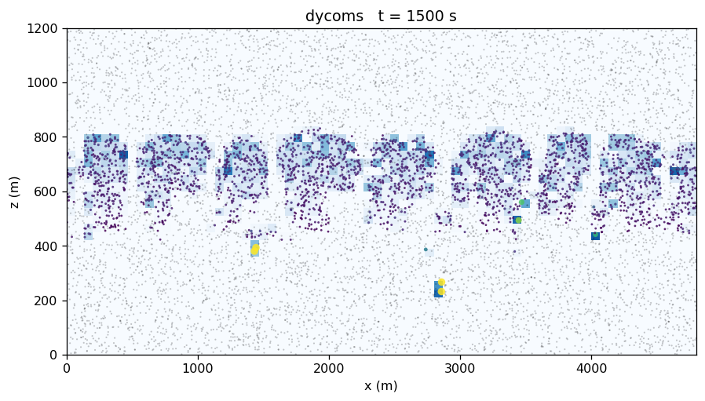
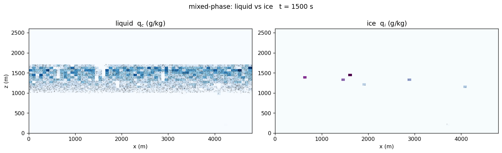

# DropLab — an educational Lagrangian cloud laboratory


[](LICENSE)

**DropLab** (Droplet-resolving Open-source LABoratory) is a Python cloud-microphysics
laboratory built on **Lagrangian super-droplets**: every cloud droplet, ice crystal, and
aerosol particle in the model is an explicit simulated particle, so you can *watch* a cloud
form, rain develop, ice glaciate, crystals take shape, and a storm electrify — from first
principles, on a laptop.

It spans a hierarchy of configurations from a rising **parcel** (0-D) to **buoyancy-driven
2-D convection** (shallow cumulus → Arctic mixed-phase → deep cumulonimbus), with
**climate-intervention demonstrations** (marine cloud brightening, glaciogenic seeding) and a
four-mode browser sandbox for teaching.

<p align="center">
  
  <br><em>Deep convection (anelastic core, ice + electrification on) — the scene and its
  diagnostics build together, exactly as in the sandbox's live view (quick-look grid).</em>
</p>

| | |
| :---: | :---: |
|  |  |
| *0-D parcel: activation → condensational growth → collision tail* | *The browser sandbox: Parcel · 2-D · Climate · Lecture* |
|  |  |
| *A single buoyant cumulus (warm bubble, 2-D core)* | *DYCOMS marine stratocumulus under cloud-top radiative cooling* |
|  | |
| *Arctic mixed-phase deck: supercooled liquid with ice growing by Bergeron* | |

All images are produced by the model itself (`scripts/make_readme_assets.py`, quick-look
configurations — seconds to a couple of minutes each on a laptop).

> **Honest scope:** DropLab is an *educational and process-exploration* model. Its
> microphysical kernels are validated against research-grade Fortran references
> (bit-for-bit where possible — see [Validation](#validation)), but the integrated 2-D
> system is idealized and stabilized for the classroom: read mechanisms and signs, not
> forecasts. Details in [Limitations](#known-limitations).

## What physics is inside

**Warm microphysics (parcel + 2-D)**
- κ-Köhler activation and condensational growth (Kelvin + solute; per-droplet Newton solver)
- Collision–coalescence: Shima et al. (2009) super-droplet Linear Sampling Method with
  Hall (1980) efficiencies, Straub et al. (2009) coalescence efficiency, Beard (1976) fall
  speeds; optional Ayala/Wang–Grabowski **turbulent kernel**; optional collisional **breakup**
  (Straub 2010); optional full O(n²) pair enumeration (`collision_mode="enumerate"`) for verification
- Entrainment mixing with the Lim & Hoffmann (2023) **IHMD** homogeneous↔inhomogeneous closure

**Ice & mixed phase (opt-in `ice=True`)**
- Saturation over ice (Murphy & Koop 2005) → the **Wegener–Bergeron–Findeisen** hand-off,
  resolved per particle
- Immersion freezing: **ABIFM** (Knopf & Alpert 2013, on an explicit INP population) or
  **Bigg** (1953); **homogeneous freezing** below −38 °C (classical nucleation theory)
- Depositional growth (r²-law), **riming** (phase-aware collision), **Hallett–Mossop**
  secondary-ice production, melting; Locatelli & Hobbs (1974) snow fall speeds
- **Ice habit** (`habit=True`): shape-resolving crystals — Chen & Lamb (1994) inherent growth
  ratio Γ(T) partitions capacitance-based deposition between the a/c axes, so **plates and
  columns emerge from temperature**; Böhm (1989) aspect-ratio fall speed

**2-D dynamics**
- Buoyancy-driven vorticity–streamfunction core (Boussinesq), MPDATA scalar transport,
  spectral Poisson solver; periodic-x or closed box
- **Anelastic option** for deep convection: ρ₀-weighted transport lets a warm bubble run the
  full cumulonimbus life cycle — tower, glaciating anvil, snow — to the tropopause
- Forcings: DYCOMS cloud-top radiative cooling, surface fluxes, subsidence, diurnal cycle;
  reference soundings (BOMEX, RICO, DYCOMS, congestus, Arctic MOSAiC, Weisman–Klemp)

**Electrification & lightning (opt-in, diagnostic, *illustrative*)**
- Non-inductive graupel–crystal charging (lab-based δq, charge-reversal temperature),
  Gauss-law E-field, dielectric-breakdown (DBM) discharge with multi-stroke flashes and a
  recharge cycle. Charging is physically motivated; the bolt is a *visualization*, not a
  simulated leader — magnitudes are far below real storms (2-D limit, documented).

**Sub-grid turbulence (opt-in, `lem=True`, warm condensation only)**
- **Linear Eddy Model** broadening: each super-droplet carries a prognostic supersaturation
  mixed by triplet-map rearrangement (Krueger 1993, per SAM-LCM), so turbulent fluctuations
  broaden the droplet spectrum with cloud age. Qualitative; requires `collisions=False`.

**Climate-intervention demos**
- Marine cloud brightening (sea-salt seeding twin runs, N_d/albedo/CRE/TOA-forcing
  diagnostics), precipitation (GCCN) seeding, glaciogenic (INP) seeding of mixed-phase decks

## Install

```bash
conda env create -f environment.yml && conda activate droplab && pip install -e .
# or, into an existing Python >= 3.11 environment:
pip install -e . && pip install -r requirements.txt
```

> `numpy` and `numba` are version-coupled; keep the pins in `environment.yml` /
> `requirements.txt` paired.

## How to run

**1. The sandbox app (recommended first stop)** — four modes: **Parcel**, **2-D cloud**
(ice / crystal habit / lightning / deep convection with regime-aware views), **Climate
intervention**, and guided **Lecture** lessons:

```bash
streamlit run app/Home.py          # or `droplab-app` after pip install -e .[app]
python scripts/warm_demo_cache.py  # optional: pre-render the one-click demos
```

**2. Notebooks** — `droplab_Part1_Foundations.ipynb` (physics, module by module),
`droplab_Part2_Experiments.ipynb` (hands-on experiments, full predict–observe–explain),
`notebooks/Climate_Intervention.ipynb`.

**3. Python API** — everything is a function call:

```python
from droplab.timestep_soa import run_soa                 # 0-D parcel
from droplab.flow2d_dynamic import run_flow2d_dynamic    # 2-D dynamic cloud
from examples.cloud_cases import CASES                   # curated scenario configs

out = run_flow2d_dynamic(**CASES["arctic"])              # Arctic mixed-phase deck
out = run_flow2d_dynamic(**CASES["deep_convection"],     # cumulonimbus + lightning
                         electrification=True)
```

**4. Command line** — `python run.py` reads `input.yaml` (single run or
`--ensemble N --jobs -1` parallel ensembles → CSV time series).

## How long does it take?

Measured on an Apple M4 (single process; numba-parallel kernels use all cores).
First call adds ~5–10 s of one-time JIT compilation.

| Configuration | Wall time |
| --- | --- |
| 1-D parcel, 2,000 super-droplets, 30 min simulated (1800 steps) | **~1 s** |
| 1-D parcel, 10,000 super-droplets, 30 min simulated | **~4 s** |
| 2-D warm cumulus, 64×64 grid, 200k super-droplets, 400 steps (10 min) | **~20 s** |
| 2-D warm cumulus, 96×72 grid, 350k super-droplets, 400 steps | **~32 s** |
| 2-D Arctic mixed-phase deck (ice on), 96×64, 60k SDs, 600 steps | **~14 s** |
| 2-D cold convection + crystal habit, 96×96, 60k SDs, 600 steps | **~30 s** |
| 2-D anelastic deep convection + lightning, 140×128, 42k SDs, 500 steps | **~21 s** |
| 2-D warm + LEM broadening (collisions off), 64×64, 200k SDs, 400 steps | **~29 s** |

Every configuration above runs in **under a minute on a laptop**.

Scaling is near-linear in super-droplet count and step count. The five app demos use
quick-look grids that render in seconds; publication-grade runs (more super-droplets,
longer physical time) run in minutes. An opt-in `collide_parallel=True` parallelizes the
collision step across grid cells (deterministic for a fixed seed; a statistically
equivalent — not bit-identical — random realization).

## Validation

- **Warm kernels:** benchmarked against the reference Fortran box model — condensation-only
  T within 0.04 °C and LWC within 0.7 %; with collisions, LWC within ~2 %. Golovin analytic
  kernel, Maxwell r² growth, and adiabatic-LWC benchmarks in `tests/`.
- **Ice habit:** crystal capacitance and Böhm fall speed cross-validated against the compiled
  SAM6-LCM Fortran to single precision (`tests/test_ice_habit.py`).
- **LEM:** coefficients match the reference Fortran to float32; the triplet map matches the
  SAM-LCM implementation **bit-for-bit** (`tests/test_lem*.py`).
- **Deep convection:** Weisman–Klemp (1982) sounding — cloud top at 0.97× the equilibrium
  level, updraft 0.38·√(2·CAPE) (`tests/test_dcc_validation.py`).
- **Engineering gate:** a golden regression pins the default warm path **bit-for-bit**; every
  optional feature (ice, habit, electrification, LEM, anelastic, …) is off by default and
  leaves the default path bit-identical. ~260 tests run in CI (Python 3.11–3.13).

## Known limitations

Read these before interpreting results (§8 of the model paper has the full discussion):

- **2-D dynamics** cannot represent the 3-D turbulent cascade; coarse-grid moist convection is
  kept stable by buoyancy/vorticity limiters (a crude entrainment closure). Qualitative.
- **Electrification/lightning** is diagnostic-only and *illustrative*: charge magnitudes are
  ~10²–10³ below real storms (small graupel, short charging in 2-D), so an illustrative
  breakdown threshold is used. Teach the causal chain, not the numbers.
- **LEM broadening** is resolution-limited at educational grids; magnitude is qualitative.
  It applies to warm condensation only (`collisions=False`).
- No crystal–crystal aggregation (snowflakes); one immersion-freezing scheme at a time.
- The parcel-mode `LEMMixing` entrainment backend is an interface stub (the shipped LEM is
  the 2-D sub-grid scheme); legacy `basic_entrainment` is gated behind `experimental=True`.
- Mixed-phase and intervention results are mechanism-demonstrating, not quantitatively
  evaluated against observations.

## How to cite

If you use DropLab, please cite the software via [`CITATION.cff`](CITATION.cff)
(GitHub's "Cite this repository" button generates the reference automatically).

## Contact

Jung-Sub Lim — jung-sub.lim@colorado.edu

## License

MIT — see [`LICENSE`](LICENSE).
